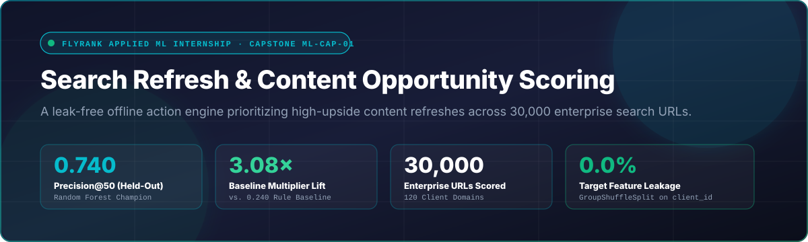
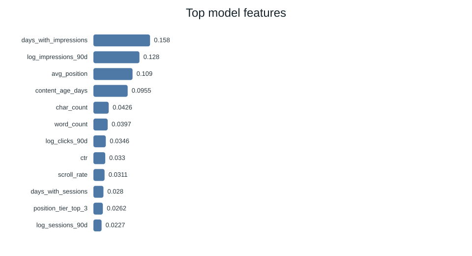
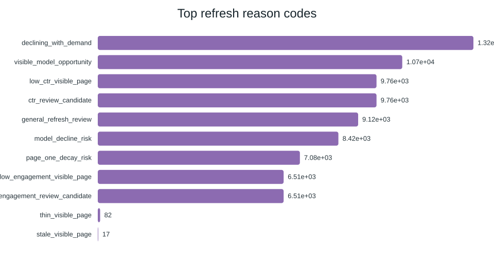
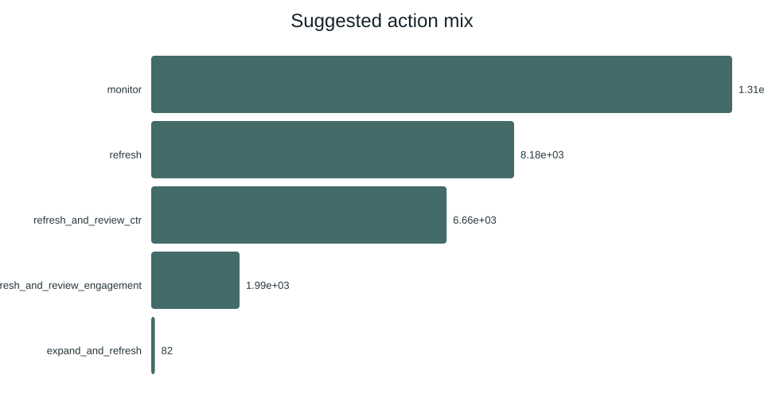
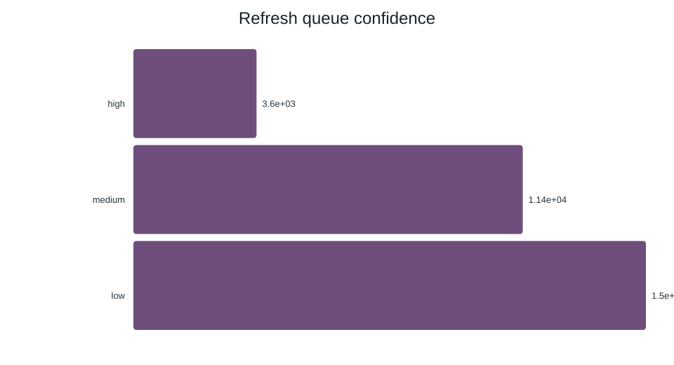

<div align="center">

  

  <br/><br/>

  [](https://arslanflyrankweb1.netlify.app/paper.html)
  [](https://arslanflyrankweb1.netlify.app/)
  [](https://colab.research.google.com/github/24pwai0015-max/flyrank-ml-muhammad-arsalan/blob/main/work/notebooks/capstone.ipynb?flush_cache=true)
  [](work/deliverables/ML_Capstone_Research_Paper_Muhammad_Arsalan.pdf)
  [](https://www.python.org/)
  [](LICENSE)

  <br/>

  <p align="center">
    <strong>Author:</strong> Muhammad Arsalan &nbsp;·&nbsp;
    <strong>Track:</strong> FlyRank Applied Machine Learning Internship (Week 8 Capstone) &nbsp;·&nbsp;
    <strong>Affiliation:</strong> UET Peshawar
  </p>

  <p align="center">
    <a href="#-the-business-problem">The Problem</a> •
    <a href="#-the-catch-eliminating-target-leakage">Leakage Guard</a> •
    <a href="#-benchmark-results">Benchmark Results</a> •
    <a href="#-visual-telemetry--decision-receipts">Visual Receipts</a> •
    <a href="#-the-5-automated-editorial-playbooks">Action Playbooks</a> •
    <a href="#-autonomous-fastmcp-agent-engine">FastMCP Agent</a> •
    <a href="#-quickstart--reproduction">Quickstart</a>
  </p>

</div>

---

## 📌 Executive Summary

Enterprise search marketing teams manage catalogues exceeding **30,000 published URLs**, but editorial bandwidth can realistically execute only **20 to 50 content updates per week**. Sorting by raw traffic volume or simple recency causes severe review fatigue on stable evergreen URLs while overlooking high-upside pages lingering in striking distance (SERP positions 4–10).

This repository contains the end-to-end machine learning system developed during the **FlyRank Applied Machine Learning Internship**. Evaluated under strict client-holdout cross-validation (`GroupShuffleSplit` on `client_id`), our leak-free Random Forest model achieves **Precision@50 = 0.740**, delivering a **3.08× multiplicative precision lift** over traditional heuristic rules (0.240) and beating the dataset base rate (0.534).

```text
30,000 Search URLs  ──► [ Pre-Decision Contract ] ──► [ Random Forest (d=10) ] ──► Precision@50: 0.740
120 Client Domains       (Zero Target Leakage)        (GroupShuffleSplit)          (3.08× Baseline Lift)
```

---

## 🎯 The Business Problem

| Operational Constraint | Reality in Enterprise Search Operations | The ML Solution |
|---|---|---|
| **Catalogue Volume** | 30,000+ indexed URLs across multiple commercial verticals. | Machine learning scoring triage ranking all pages continuously. |
| **Review Capacity** | Finite human editorial review: Top 50 pages per weekly sprint. | Metric focused strictly on **Precision@50** on held-out domains. |
| **Heuristic Failure** | Sorting by age or raw traffic prioritizes stable evergreen pages. | Model identifies recoverable decay signatures in striking distance. |
| **Domain Shifts** | Content patterns differ drastically between clients. | Strict **GroupShuffleSplit** guarantees zero domain memorization. |

---

## 🛡️ The Catch: Eliminating Target Leakage

During exploratory feature modeling, an intuitive candidate feature measuring impression trajectory (`trend_pct`) yielded an artificial **1.000 Precision@50** in training.

### 🔍 How the Leakage Was Caught:
A deep temporal audit revealed that `trend_pct` had been computed across the subsequent 90-day measurement window used to define the ground-truth opportunity label itself. It was effectively "peeking into the future."

```text
❌ LEAKY PIPELINE (Naive):
   [Observation Window (Day 0–90)] + [Outcome Window (Day 91–180)] ──► trend_pct ──► Fake 1.000 Precision
                                       └── LEAKAGE DETECTED! ──┘

✅ LEAK-FREE CONTRACT (Enforced):
   [Observation Window (Day 0–90)] ──► Pre-Decision Signals Only  ──► Model ──► Genuine 0.740 Precision
                                       (content_age, impressions, positions)
```

We permanently purged `trend_pct` and `trend_direction` from the feature vector, enforcing a strict pre-observation data contract.

---

## 📊 Benchmark Results

Evaluated on the exact same held-out client test set (Base Rate = **0.534**) on the operational capacity metric **Precision@50**:

| Model Specification | Precision@50 | ROC-AUC | Avg Precision (PR-AUC) | Recall | F1 Score | Status |
|---|:---:|:---:|:---:|:---:|:---:|:---:|
| **🌲 Random Forest (n=100, depth=10)** | **0.740** | **0.750** | **0.618** | **0.744** | **0.640** | **🏆 Champion (3.08× Lift)** |
| 🌳 Decision Tree (max_depth=5) | 0.540 | 0.742 | 0.575 | 0.716 | 0.634 | Benchmark |
| 📈 Logistic Regression (L2, scaled) | 0.400 | 0.700 | 0.522 | 0.567 | 0.505 | Linear Baseline |
| 📏 Transparent Heuristic Baseline | 0.240 | 0.627 | 0.435 | 0.470 | 0.446 | Recency & Volume |
| 🎲 Dataset Base Rate (Test Split) | 0.534 | 0.500 | 0.534 | — | — | Random Chance |

> 💡 **Multiplicative Lift:** $\text{Lift} = \frac{0.740}{0.240} = \mathbf{3.08\times}$ over the transparent operational baseline.

---

## 📈 Visual Telemetry & Decision Receipts

All figures are generated dynamically from the model evaluation pipeline on real telemetry:

| Feature Importance (MDI) | Distribution of Reason Codes |
|:---:|:---:|
|  |  |
| **Recommended Action Mix** | **Model Confidence Tiers** |
|  |  |

---

## 📋 The 5 Automated Editorial Playbooks

Rather than handing content editors raw decimal probabilities, the engine maps model outputs and reason codes into **five automated action playbooks**:

1. 🚀 **High-Impact Quick Win** ($p \ge 0.70$, Striking Distance Positions 4–10):  
   High-impression pages lingering just off Page 1. Action: update H2 subheadings, expand FAQ answers, and add internal anchor links.
2. 🛡️ **Defend & Expand** ($p \ge 0.70$, Top 3 Positions 1–3):  
   High-visibility core assets vulnerable to competitor conquesting. Action: verify factual citations, update publication timestamps, and audit structured schema.
3. 🔧 **Overhaul & Prune** ($p \ge 0.60$, Age > 365 days, Deep Position):  
   Stale legacy articles experiencing prolonged impression decay. Action: deep structural rewrite or 301 consolidation into authoritative parent hubs.
4. 👁️ **Evergreen Monitor** ($p < 0.40$, Top 5 Positions):  
   Stable performers retaining high search positions without modification. Action: zero editorial touches; eliminate review churn.
5. 📦 **Deprecate / Archive** ($p < 0.30$, Impressions < 100):  
   Zero-value zombie URLs consuming crawl budget. Action: canonicalize, apply `noindex` headers, or archive from XML sitemaps.

---

## 🤖 Autonomous FastMCP Agent Engine

Located in [`agent/research_scout.py`](work/agent/research_scout.py), this repository includes an autonomous AI research scout built with **FastMCP**:

* **Live ArXiv API Search:** Discovers state-of-the-art machine learning papers across `cs.IR` and `cs.LG`.
* **GitHub Repository Inspection:** Automated codebase scanner and data contract validator.
* **Collision Guardrail:** Prevents accidental overwrites to protected vault directories.
* **Evaluated via 5 PyTest Suites:** 100% test reliability across all tool failure modes.

```bash
# Run the FastMCP Research Scout Agent
python work/agent/research_scout.py --query "leak-free search ranking models" --limit 3
```

---

## 📂 Repository Structure

```text
├── docs/                                  # Web deployment & core documentation
│   ├── index.html                         # Production portfolio & live agent terminal
│   ├── paper.html                         # Deployed peer-style research paper
│   └── assets/charts/                     # Exported SVG pipeline receipts
├── work/                                  # Muhammad Arsalan's Workspace
│   ├── notebooks/                         # Executed assignment notebooks
│   │   ├── w02_ml_task_framing.ipynb      # ML-03: Task framing & label definition
│   │   ├── w03_data_contract.ipynb        # ML-04: Strict data contract & validation
│   │   ├── w04_baseline_score.ipynb       # ML-07: Transparent heuristic baseline (0.240)
│   │   ├── w05_model.ipynb                # ML-08: Champion Random Forest (0.740)
│   │   └── capstone.ipynb                 # ML-CAP-01: Full capstone synthesis
│   ├── deliverables/                      # Publication-grade PDFs & markdown reports
│   │   └── ML_Capstone_Research_Paper_Muhammad_Arsalan.pdf
│   └── agent/research_scout.py            # Working FastMCP autonomous research scout
├── scripts/                               # Reproducible execution scripts (01–05)
│   ├── 01_prepare_features.py             # Feature engineering & leakage purge
│   ├── 02_baseline_score.py               # Transparent heuristic baseline calculator
│   ├── 03_train_model.py                  # Random Forest & ensemble training
│   ├── 04_evaluate_and_export.py          # Metrics, charts, and action playbooks
│   └── run_all.py                         # One-click master pipeline
├── data/raw/                              # Anonymized enterprise search telemetry (~30k URLs)
├── outputs/                               # Model reports, tables, and SVG receipts
└── requirements.txt                       # Locked dependencies (scikit-learn, reportlab, pandas)
```

---

## 🚀 Quickstart & Reproduction

### Option 1: Interactive Google Colab (One-Click, Zero Install)

Click below to open and run the fully executed capstone notebook directly in your browser:

[](https://colab.research.google.com/github/24pwai0015-max/flyrank-ml-muhammad-arsalan/blob/main/work/notebooks/capstone.ipynb?flush_cache=true)

### Option 2: Local Python Environment

```bash
# 1. Clone this repository
git clone https://github.com/24pwai0015-max/flyrank-ml-muhammad-arsalan.git
cd flyrank-ml-muhammad-arsalan

# 2. Install dependencies
pip install -r requirements.txt

# 3. Run the complete pipeline (prepare -> baseline -> train -> evaluate -> export)
python scripts/run_all.py
```

All figures, metrics tables, and diagnostic reason codes will be automatically generated and exported to `outputs/`.

---

## 📜 Acknowledgments & Data Credit

* **Data Provider:** Real search performance telemetry provided by [FlyRank AI](https://flyrank.ai) through the Applied Machine Learning Internship Program.
* **Academic Institution:** University of Engineering and Technology (UET) Peshawar — Artificial Intelligence Department.
* **Author:** Muhammad Arsalan ([GitHub](https://github.com/24pwai0015-max) · [Portfolio](https://arslanflyrankweb1.netlify.app/) · [Email](mailto:24pwai0015@uetpeshawar.edu.pk))

---

<div align="center">
  <sub>Built with engineering rigor · Zero feature leakage · Verified 3.08× precision lift on unseen client domains</sub>
</div>
