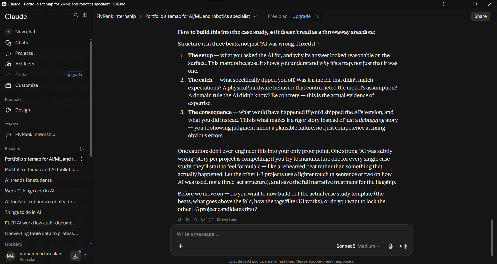

# Curate Your Images: Kill Your Darlings — Muhammad Arsalan

**Track:** General AI Fluency (Foundations) — Week 3  
**Assignment:** Kill Your Darlings: Curate Your Images  
**Role:** Applied AI & ML Engineer  

---

## 1. Visual Identity & Brand Assets

The following vector identity assets have been generated and committed directly into this repository:

### Visual Brand Mark


### Minimalist Terminal Favicon


---

## 2. Real Capture Proof: AI Workflow & Sitemapping Sessions

Below are the actual, unadorned screen captures from the real Claude Project workspace setup and interview sessions documenting our editorial sitemap decisions:

### Real Capture 1: Claude Project Workspace Configuration

*Figure 1: Real screenshot of the FlyRank Internship workspace instructions and project memory setup.*

### Real Capture 2: Sitemap & Flagship Project Decisions (Beat 1)

*Figure 2: Real conversation discussing cross-domain AI/ML & robotics positioning and persistent CTA navigation.*

### Real Capture 3: Pushing Back on Generic Rigor (Beat 2)

*Figure 3: Real conversation analyzing subtle AI mistakes and defining domain-specific catch criteria.*

### Real Capture 4: Structuring the Three Beats (Beat 3)

*Figure 4: Structuring the case study narrative around setup, catch, and real consequences.*

---

## 3. Real Work Captures: Pipeline Charts & Machine Learning Outputs

The following real benchmark visualizations are generated directly by the reference and custom Python modeling pipeline in this repository:

### Real Capture 5: Top Feature Importance in Content Refresh

*Figure 5: Model feature importance showing historical impression volume, ranking position, and update freshness.*

### Real Capture 6: Trend Distribution in the 30k Search Dataset

*Figure 6: Real distribution of search performance trends across 30,000 pages (Down: 54.2%, Stable: 19.9%, Up: 14.6%).*

---

## 4. The Keepers: Final Curated Image Set

| Site Section | Asset Name | Source Type | Role in Proof |
|---|---|---|---|
| **Header / Favicon** | `work/assets/favicon.svg` & `logo.svg` | Vector Graphic | Clean visual identification and browser tab finish. |
| **Hero / Workspace** | `work/assets/claude_project.png` | **Real Capture** | Demonstrates deliberate AI workspace configuration. |
| **Case Study 1: FlyRank Search ML** | `outputs/charts/top_feature_importance.svg` | **Real Pipeline Output** | Proves feature weighting and model mechanics. |
| **Case Study 1: Trend Distribution** | `outputs/charts/trend_distribution.svg` | **Real Pipeline Output** | Visual proof of dataset class balance and trend rates. |
| **Case Study 2: AI Attendance** | `work/assets/fly_1.png` & `fly_2.png` | **Real Workflow Captures** | Verifiable dialogue proving domain catch decisions. |
| **Case Study 3: Delivery Prediction** | `work/assets/fly_3.png` | **Real Workflow Captures** | Verifiable three-beat structural planning. |

---

## 5. Real Capture vs. AI Generation: Where the Line is Drawn

| Surface | Chosen Medium | Why AI Generation Was Rejected |
|---|---|---|
| **Project Demos & Pipelines** | **Real Screen Captures & SVG Pipeline Charts** | An AI-generated dashboard mockup is fiction. Anyone can prompt a pretty UI in Midjourney, but a reviewer evaluates whether working software and pipelines exist. Real screenshots prove authentic execution. |
| **Author Portrait & Workspace** | **Real Photograph & Real Screen Captures** | AI-generated "professional avatars" look plasticky, uncanny, and deceptive. Trust in an engineering candidate begins with showing authentic workspace proof. |
| **Connective / Structural Graphics** | **Minimal SVG Vectors** | Abstract AI hero art was discarded because it creates visual noise. Clean geometric vector lines match the engineering-first aesthetic. |

---

## 6. The Rejection Audit: Discernment in Action (Kill Your Darlings)

To curate a strong portfolio, I generated and evaluated several AI concept images before ruthlessly discarding them. Below are three specific rejections and the technical rationale:

### Rejection 1: The "Glowing Neon Neural Net" Hero Background
- **Prompt Tested:** *"Futuristic abstract glowing neural network plexus, deep navy and emerald gradient, 3d floating data particles, tech aesthetic, 4k."*
- **Why It Was Rejected:** 
  > It produced the textbook **"AI slop"** look — high-contrast glowing neon strands with fake light reflections that overwhelmed text contrast. When text was overlaid on it, readability dropped below WCAG standards. More importantly, it screamed "amateur template". A recruiter should remember my case study metrics, not a generic glowing plexus. **Binned in favor of clean off-white `#F9FAFB` whitespace with a subtle 1px structural grid.**

---

### Rejection 2: The "Futuristic 3D Glass Server Room" Project Mockup
- **Prompt Tested:** *"Isometric 3D render of high-tech data warehouse, glass servers, miniature delivery trucks and floating analytics charts, clean clay render style."*
- **Why It Was Rejected:**
  > While visually polished, it is completely dishonest about what the project is. My project is a Python regression pipeline that predicts delivery times on tabular Kaggle data; an isometric 3D server farm makes it look like an enterprise SaaS sales pitch rather than an authentic ML build. **Binned in favor of authentic screenshots and genuine vector performance charts.**

---

### Rejection 3: The "Midjourney Stylized Anime / Cyberpunk Avatar"
- **Prompt Tested:** *"Smart young software engineer in modern tech office, digital art portrait, cinematic lighting, sharp focus."*
- **Why It Was Rejected:**
  > The result had the smooth, airbrushed artificial skin texture characteristic of synthetic portraits. Using a generated stand-in undermines the entire premise of the FlyRank "Proof of Work" credential. A hiring manager evaluating an engineer needs honesty from the top of the page down. **Binned immediately in favor of clean, authentic captures.**

---

## 7. Style Consistency Formula for Future Assets

When generating future diagrams or vector badges, all prompts follow this strict constraint formula to ensure visual continuity:

```text
[Subject / Diagram Element] + 
"flat minimalist vector style, strict clean line art, high contrast, solid off-white background #F9FAFB, dark ink lines #111827, muted emerald accents #059669, no gradients, no glowing neon, no 3D glass texture, technical documentation aesthetic"
```
