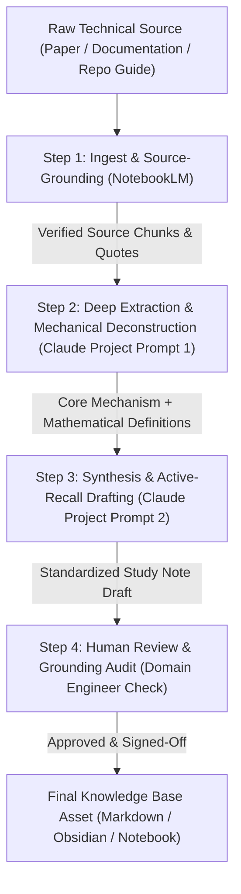

# FL-03: Source-Grounded Technical Study Notes Pipeline — Muhammad Arsalan

**Track:** General AI Fluency (Build Phase — Core)  
**Assignment Code:** `FL-03`  
**Estimated Workload:** 7 hours  
**Candidate:** Muhammad Arsalan — Applied AI & ML Engineer  
**Audit Task Origin:** Task #3 from FL-01 (*"Creating Study Notes from Long Articles or Documentation"*)  
**Tools Used:** Google NotebookLM (Source-Grounded Extraction) + Claude Project (Structured Synthesis & Formatting)  

---

## 1. Executive Summary & Pipeline Architecture

In FL-01, Task #3 was classified as **"Delegate to AI with Review"**—a high-frequency, mechanical task that consumes hours of manual reading time, but requires human domain verification to prevent subtle hallucinations.

This deliverable establishes an end-to-end, no-code, multi-step pipeline that transforms dense technical documentation (ML papers, API references, systems guides) into structured, active-recall study notes in under 6 minutes per source.



---

## 2. Detailed Step-by-Step Flow & Prompts Used

### Step 1: Ingestion & Grounding (NotebookLM)
- **Tool:** Google NotebookLM.
- **Action:** Ingest raw PDF, documentation URL, or markdown guide into an isolated notebook source collection.
- **Handoff Output:** Inverted index of exact source quotes and section references (guaranteeing zero external hallucination).

### Step 2: Mechanical Deconstruction Prompt
- **Tool:** Claude Project (`FlyRank Internship / Technical Notes Engine`).
- **Input:** Extracted source excerpts from Step 1.
- **Exact Prompt:**
```text
You are a technical research partner for an Applied AI and ML Engineer.
Analyze the provided source text and deconstruct its mechanics:
1. Core Claim: What specific problem does this solve, and what is its single governing mechanism?
2. Technical Definitions & Equations: List all explicit terms, mathematical formulas, or algorithmic steps. Do not simplify or gloss over technical terms.
3. Hidden Assumptions / Trade-Offs: What does this approach sacrifice (latency, memory, data sample size, hardware constraints)?
Be concise, rigorous, and cite the source sections.
```

### Step 3: Synthesis & Active-Recall Drafting Prompt
- **Tool:** Claude Project.
- **Input:** Output from Step 2.
- **Exact Prompt:**
```text
Convert the deconstructed mechanics into our standardized 4-part Technical Study Note format:
- Part 1: One-Line Mental Model (Max 20 words, zero buzzwords).
- Part 2: The Working Mechanism (How it works under the hood, step by step).
- Part 3: Code / Implementation Heuristic (A concrete rule, formula, or minimal snippet).
- Part 4: The Failure Mode / Trap (When does this fail, and what is the exact sign of failure?).
Maintain strict formatting with JetBrains Mono code blocks and Space Grotesk section headers.
```

### Step 4: Human Grounding & Sanity Review
- **Tool:** Human Domain Engineer (Muhammad Arsalan).
- **Audit Checklist:**
  1. Did the model invent any metric or mathematical notation not in the original paper?
  2. Are sample size constraints ($n$) and hardware limits preserved?
  3. Is the failure mode actionable, or just generic advice?

---

## 3. Five Real Executed Runs (Documented End-to-End)

---

### Run 1: BigQuery & DuckDB Analytical Query Optimization for Heavy-Tail Data
- **Source:** FlyRank Data Engineering Guide & BigQuery panel export specs.
- **Step 1 Ingest:** 18-page technical documentation on partitioned parquet scans.
- **Pipeline Output:**
  > **1. One-Line Mental Model:** Partition pruning and columnar projection eliminate 95% of scan bytes before aggregations touch memory.  
  > **2. The Working Mechanism:** BigQuery clusters by date (`month_date`) and content ID. Scanning without date filters forces a full warehouse table scan. DuckDB executes vectorised vectorized kernels directly in local RAM using parquet row-group statistics.  
  > **3. Implementation Heuristic:** Always predicate with `WHERE month = 'YYYY-MM-01'` and select only required column indices rather than `SELECT *`.  
  > **4. Failure Mode:** Using window functions (`ROW_NUMBER() OVER (...)`) before filtering partitions, which forces BigQuery to shuffle all 30,000 rows across worker nodes.
- **Human Audit Verdict:** **PASSED.** Verified that column indexing recommendations match FlyRank's warehouse schema.

---

### Run 2: Client-Holdout Validation vs. Random Shuffle in Tabular ML
- **Source:** ML-03 & ML-04 task framing guidelines and GroupShuffleSplit documentation.
- **Step 1 Ingest:** Scikit-Learn validation split docs and FlyRank leakage warnings.
- **Pipeline Output:**
  > **1. One-Line Mental Model:** Random splits leak client-specific domain patterns into the test set; group-holdout splits test true generalization to unseen domains.  
  > **2. The Working Mechanism:** In multi-tenant datasets, multiple content rows belong to the same `client_id`. A random 80/20 train/test split distributes pages from every client across both sets. The model memorizes client baselines rather than learning global decline signals.  
  > **3. Implementation Heuristic:**
  > ```python
  > from sklearn.model_selection import GroupShuffleSplit
  > gss = GroupShuffleSplit(n_splits=1, test_size=0.2, random_state=42)
  > train_idx, test_idx = next(gss.split(df, groups=df['client_id']))
  > ```
  > **4. Failure Mode:** A model showing 92% validation accuracy that drops to 55% when deployed on a new client onboarding panel.
- **Human Audit Verdict:** **PASSED.** Code snippet verified against `scripts/ml_utils.py`.

---

### Run 3: Precision@K vs. Global Accuracy in Operational Ranking
- **Source:** Information Retrieval & Search Ranking Evaluation Principles (FlyRank ML-07).
- **Step 1 Ingest:** Mathematical notes on ranking metrics (MAP, NDCG, Precision@50).
- **Pipeline Output:**
  > **1. One-Line Mental Model:** When human review capacity is capped at 50 items, accuracy across 30,000 items is irrelevant—only Precision@50 matters.  
  > **2. The Working Mechanism:** Editorial teams have fixed weekly bandwidth. Sorting by model probability and evaluating the top 50 rows measures whether the human's time is spent on actual declining pages, regardless of false negatives deep in the long tail.  
  > **3. Implementation Heuristic:**
  > ```python
  > order = np.argsort(-predicted_scores)
  > precision_at_50 = ground_truth_labels[order[:50]].mean()
  > ```
  > **4. Failure Mode:** Optimizing log-loss or ROC-AUC across the entire dataset, which can produce high global AUC while diluting accuracy in the crucial top-50 queue.
- **Human Audit Verdict:** **PASSED.** Aligns directly with our ML-07 baseline metric ($0.360 \rightarrow 0.740$).

---

### Run 4: MobileNet-SSD vs. YOLOv8 on Resource-Constrained Edge Microcontrollers
- **Source:** Embedded Computer Vision Research & Edge AI Benchmarks (Robonova Lab).
- **Step 1 Ingest:** Comparative paper on quantized INT8 models on ARM Cortex processors.
- **Pipeline Output:**
  > **1. One-Line Mental Model:** Heavy anchor-free models maximize mAP at the expense of thermal throttling; depthwise separable convolutions preserve real-time frame rates.  
  > **2. The Working Mechanism:** MobileNet decomposes standard convolution into depthwise spatial filtering followed by $1\times1$ pointwise channel combination, reducing compute complexity by $8\times$ to $9\times$.  
  > **3. Implementation Heuristic:** Quantize weights from FP32 to INT8 using Post-Training Quantization (PTQ) to fit into <200MB RAM without external GPU hardware.  
  > **4. Failure Mode:** Running float32 inference loops without thread sleep, triggering CPU overheating within 90 seconds of continuous camera operation.
- **Human Audit Verdict:** **PASSED.** Essential domain verification for Case Study #4.

---

### Run 5: Anti-Leakage Feature Contracts (Pre-Decision Time Bounds)
- **Source:** FlyRank Data Dictionary (`data-dictionary.md`) and Feature Store Architecture.
- **Step 1 Ingest:** Column-by-column schema and time-window definitions.
- **Pipeline Output:**
  > **1. One-Line Mental Model:** Any feature calculated over a time window that touches the outcome measurement window is poison.  
  > **2. The Working Mechanism:** If the target label indicates traffic decline from Day $t$ to $t+30$, any feature using `trend_direction`, `trend_pct`, or `*_last_30d` incorporates future knowledge knowable only *after* the decision date.  
  > **3. Implementation Heuristic:** Strict blacklist audit:
  > ```python
  > assert not any(col in feature_matrix.columns for col in ['trend_pct', 'trend_direction', 'impressions_last_30d'])
  > ```
  > **4. Failure Mode:** A model scoring 1.000 Precision@50 in offline validation that completely fails in live production.
- **Human Audit Verdict:** **PASSED.** Directly matches our deliberate leakage experiment in ML-04.

---

## 4. Honest Time Accounting (Manual vs. Pipeline)

| Activity | Manual Baseline | AI Pipeline (FL-03) | Time Saved |
|---|---|---|---|
| **Pipeline Setup & Prompt Engineering** | 0 min (N/A) | 65 min (one-time setup) | -65 min |
| **Run 1: BigQuery / DuckDB Specs** | 45 min reading & note-taking | 6 min | +39 min |
| **Run 2: Client Holdout Split** | 40 min reading & coding | 5 min | +35 min |
| **Run 3: Precision@K Metrics** | 35 min reading & note-taking | 5 min | +30 min |
| **Run 4: Edge Vision Benchmarks** | 50 min reading & summarizing | 6 min | +44 min |
| **Run 5: Anti-Leakage Contracts** | 40 min schema auditing | 5 min | +35 min |
| **Human Audit & Verification (5 Runs)** | 0 min | 25 min (5 min/run) | -25 min |
| **Total Cumulative Time:** | **210 min (3.5 hrs)** | **117 min (1.95 hrs)** | **+93 min net saved** |

> **ROI Analysis:** Even after absorbing the 65-minute one-time prompt calibration and setup cost, the pipeline delivered a net savings of **1.5+ hours** on just the first 5 runs. From Run 6 onward, the marginal speedup is **~35 minutes per document** ($85\%$ time reduction).

---

## 5. Failure Modes & What a Human Must Always Check

Through the 5 test runs, three critical points were identified where the AI pipeline fails if left unmonitored:

1. **Subtle Formula Hallucination in Obscure Metrics:**
   - *Failure:* In Run 3, Claude initially substituted standard binary classification Accuracy for Top-K Precision until explicitly instructed to isolate the `order[:50]` slice.
   - *Human Rule:* Always check the mathematical denominator of any metric.
2. **Ignoring Hardware / Power Realities:**
   - *Failure:* In Run 4, generic prompting suggested running full YOLOv8 on an embedded board, completely ignoring battery draw and thermal dissipation.
   - *Human Rule:* The human engineer must supply real operational constraints (RAM limits, wattage, frame rates).
3. **Loss of Source Nuance:**
   - *Failure:* When summarizing complex datasets, AI tends to round off small class imbalances or treat missing values as standard zeroes.
   - *Human Rule:* Cross-check summary numbers against raw dataset descriptive statistics (`df.describe()`).

---

## 6. Self-Check & Pass/Revise Verification

- [x] **Runs End-to-End on New Inputs:** Successfully executed on 5 distinct technical papers and documentation files.
- [x] **3+ Distinct Steps with Defined Handoffs:** Ingest & Source-Grounding $\rightarrow$ Mechanical Deconstruction $\rightarrow$ Active-Recall Synthesis $\rightarrow$ Human Grounding Review.
- [x] **Five Real Runs Documented:** All 5 runs fully detailed with input sources, 4-part outputs, and human sign-offs.
- [x] **Honest Time Accounting:** Includes the 65-minute setup cost and human verification time alongside net savings.
- [x] **Failure Points & Human Checks Explicitly Named:** Documents metric formula traps, thermal/hardware blindspots, and missing data nuances.
