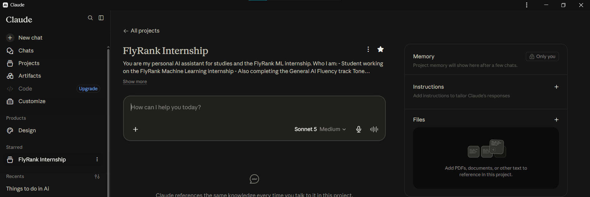

# Map It & Give It a Face — Muhammad Arsalan

**Track:** General AI Fluency — Week 3  
**Focus:** Search Intelligence, Computer Vision, and Logistics ML  

---

## 1. Visual Identity & Brand Assets


---

## 2. The Through-Line

### One-Line Claim
> **"I build applied AI and machine learning systems that turn messy data into reliable, verified decisions."**

---

### Content Map & Site Structure

#### **Page 1: Home / Portfolio (`/index.html`)**
- **Section 1: Hero**
  - Title: Muhammad Arsalan — Applied AI & ML Engineer
  - One-line claim: *"I build applied AI and machine learning systems that turn messy data into reliable, verified decisions."*
  - CTA Button: `[View Case Studies]` (scrolls to cases) / `[Get in Touch]` (scrolls to contact).
- **Section 2: Selected Case Studies (Ordered by Strength)**
  1. **Case 1: FlyRank Search Intelligence & Content Refresh Ranking** (ML Track Capstone Work)
     - *Focus:* Ranking model, client-holdout validation, leak prevention (`trend_pct`), `Precision@50 = 0.740`.
     - *Artifacts:* Pipeline architecture diagram, precision comparison table, GitHub repo link.
     - *Visual Evidence:*  
       
  2. **Case 2: AI Attendance System** (Computer Vision / Real Hardware Integration)
     - *Focus:* Real-time face recognition, eliminating proxy attendance, Streamlit dashboard.
     - *Artifacts:* UI screenshot, system flow, GitHub repo link.
  3. **Case 3: Delivery Time Prediction Engine** (Logistics Regression Modeling)
     - *Focus:* Feature engineering with pandas/NumPy, Random Forest vs XGBoost vs Linear Regression ($R^2$ winner).
     - *Artifacts:* Prediction interface demo capture, model metric chart, GitHub repo link.
- **Section 3: About & Engineering Principles**
  - Two-sentence bio: *"I work across AI/ML, data science, and robotics — building systems that combine intelligent software with real hardware, and using AI deliberately to move faster without losing rigor."*
  - Core philosophy: Honest benchmarks over inflated numbers, explicit leakage auditing, clean production-ready code.
- **Section 4: Contact & CTA**
  - Heading: *Let's build something together.*
  - Subheading: *Looking for AI/ML engineering, research roles, or collaboration.*
  - Primary Action: `[Email Me]` (`mailto:arsalan@example.com`) / `[Book an Intro Call]`.
  - Links: GitHub (`github.com/24pwai0015-max`), LinkedIn.

---

### Still Need to Gather List

| Item | Status / Source | Action Needed Before Build Week |
|---|---|---|
| **FlyRank ML precision chart** | Generated in `outputs/charts/` | Available as SVG in repo (`outputs/charts/top_feature_importance.svg`) |
| **AI Attendance System screenshot** | Local Streamlit app | Captured and organized in `work/assets/` |
| **Delivery Time Prediction screenshot** | Local Streamlit app | Captured and organized in `work/assets/` |
| **Headshot / Avatar** | Personal photo | Clean, well-lit photo with neutral background |
| **Resume PDF** | Local workspace | Export single-page PDF with matching styling |

---

## 3. Identity Kit

### Typography (Google Fonts)
- **Heading Font:** **Space Grotesk** (Weight: 600 Semi-Bold / 700 Bold) — Modern, engineering-focused, structured, and legible.
- **Body Font:** **Inter** (Weight: 400 Regular / 500 Medium) — Clean, neutral, high x-height for maximum readability on screens.
- **Code / Metrics Font:** **JetBrains Mono** (Weight: 500 Medium) — For metric tables, precision numbers, and code snippets.

---

### Color Palette (Hex Codes)

| Role | Color Name | Hex Code | Purpose |
|---|---|---|---|
| **Text (Primary)** | Ink Dark | `#111827` | High contrast body text on light backgrounds (WCAG AAA: 15.3:1) |
| **Text (Muted)** | Slate Mute | `#4B5563` | Captions, secondary labels, subheadings (WCAG AA: 7.2:1) |
| **Background (Main)** | Off-White / Paper | `#F9FAFB` | Calm, non-glare canvas that lets project screenshots stand out |
| **Surface / Card** | Pure White | `#FFFFFF` | Background for project case cards and code containers |
| **Borders / Lines** | Light Gray Line | `#E5E7EB` | Subtle structural dividers without visual clutter |
| **Accent / Link** | Mint Emerald | `#059669` | Interactive links, CTA buttons, success metrics |
| **Accent Hover** | Deep Emerald | `#047857` | Hover and active button states |

---

### Favicon & Logo Note
- **Logo:** Minimalist monospaced text mark `MA_` or `[MA] / ML` in `#111827` with a subtle `#059669` mint terminal dot.
- **Favicon:** 32×32 SVG icon with `#111827` background and sharp `#059669` terminal cursor `>_`.

---

### Reusable Style Note (For Build Consistency)
```css
/* Core Styling Rules */
--font-heading: 'Space Grotesk', sans-serif;
--font-body: 'Inter', sans-serif;
--font-mono: 'JetBrains Mono', monospace;

--color-bg: #F9FAFB;
--color-surface: #FFFFFF;
--color-ink: #111827;
--color-muted: #4B5563;
--color-border: #E5E7EB;
--color-accent: #059669;

/* Layout & Spacing */
--max-width: 960px;
--spacing-section: 64px;
--radius-card: 8px;
--card-padding: 24px;
```
*Rule: The frame is silent. Generous whitespace, no gradient animations, no neon backgrounds. The real screenshots and honest metrics are the loudest things on the page.*

---

## 4. Curate Your Images & Rejection Audit

### Curated Image Evidence (From Real Workspace Sessions)

*Figure: Real Claude Project workspace configuration for the FlyRank ML & Fluency Track.*

### Image Rejection Note (Judgment Over Generation)
> **Rejected Asset:** An AI-generated 3D glowing glass cube floating over neon neural network lines with glowing particle trails.
>
> **Why Rejected:** It had the classic "AI slop" aesthetic — generic, visually noisy, and completely disconnected from actual code. A recruiter or hiring manager looking at glowing futuristic cubes learns nothing about whether I can train a real Random Forest or prevent feature leakage. I discarded all abstract AI hero art and replaced them with crisp, unadorned screenshots of my actual Streamlit dashboards and SVG metric comparisons.
