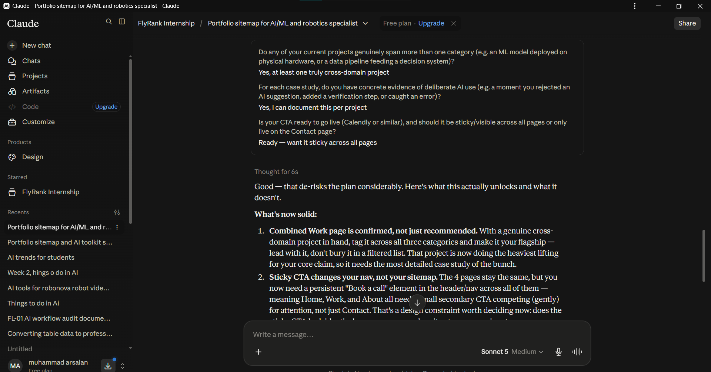
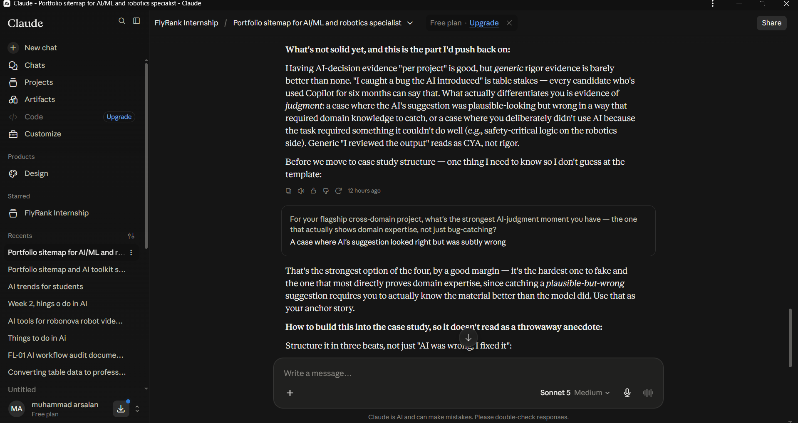

# The Through-Line: Map Content & CTAs — Muhammad Arsalan

**Track:** General AI Fluency (Foundations) — Week 3  
**Assignment:** The Through-Line: Map Content & CTAs  
**Audience (From Week 1):** Hiring managers, engineering team leads, and research mentors evaluating candidates for AI/ML, computer vision, and applied robotics roles.  
**One Action (From Week 1):** Email me or schedule an intro call.  

---

## 1. Visual Header & Identity Anchor


---

## 2. One-Line Claim Generation & Final Selection

To find a punchy single sentence that states what I prove rather than listing generic skills, I generated and evaluated 10 variations:

### Ten AI Options Evaluated
1. *"I build applied AI and machine learning systems that turn messy data into verified, real-world decisions."*
2. *"Applied AI engineer building at the intersection of machine learning, decision models, and physical systems."*
3. *"I build honest ML models and computer vision pipelines that solve operational problems without the hype."*
4. *"From search ranking to computer vision: I build and audit ML systems that prove their value before shipping."*
5. *"Machine learning engineer building decision-support models, vision tools, and hardware integrations with zero fluff."*
6. *"I design applied machine learning systems that turn complex data into reliable, production-ready decisions."*
7. *"Engineering AI systems where software intelligence meets real-world execution and rigorous offline validation."*
8. *"Applied ML and computer vision builder focused on honest benchmarks, zero leakage, and working code."*
9. *"I bridge data science and applied software to build predictive tools and intelligent systems that people actually use."*
10. *"Building practical AI, computer vision, and robotics software with verified benchmarks and disciplined engineering."*

---

### The Selected & Sharpened Claim
> ### **"I build applied AI and machine learning systems that turn messy data into reliable, verified decisions."**

**Why this one wins:**
- It is a single, memorable sentence (16 words, zero buzzwords like "passionate" or "innovative").
- It directly frames the value: taking messy, noisy real-world data (search logs, webcam feeds, delivery records) and outputting actionable, verified decisions.
- It sets up the case studies below as direct evidence of that claim.

---

## 3. The Content Map: Pages $\rightarrow$ Sections $\rightarrow$ Cases $\rightarrow$ CTAs

```
[Home (/index.html)]
  ├── 1. Hero: Claim + Quick CTAs
  ├── 2. Flagship Case: FlyRank Search Intelligence
  ├── 3. Engineering Principles & Rigor
  ├── 4. Case Previews: Attendance & Delivery ML
  └── 5. Sticky Footer CTA ────────────┐
                                       │
[Work (/work.html)]                    │
  ├── 1. Case 1: FlyRank Search ML     │──> All CTAs ladder to:
  ├── 2. Case 2: AI Attendance Vision  │    [Book an Intro Call]
  ├── 3. Case 3: Delivery Prediction   │    or [Send an Email]
  └── 4. Section CTA                   │
                                       │
[About & Rigor (/about.html)]          │
  ├── 1. Background & Education        │
  ├── 2. Deliberate AI Workflow Audit  │
  └── 3. Page CTA ─────────────────────┘
```

---

### Page 1: Home (`/index.html`)

| Section # | Section Name | Content & Case Placement | Specific Call to Action (CTA) |
|---|---|---|---|
| **1.1** | **Hero** | • Author Name & Title: *Muhammad Arsalan \| Applied AI & ML Engineer*<br>• The One-Line Claim in bold headline typography<br>• 2-sentence bio summary | Primary: `[Explore Work]` (smooth scrolls to Section 1.2)<br>Secondary: `[Book an Intro Call]` |
| **1.2** | **Flagship Feature** | **Case 1: FlyRank Search Intelligence & Content Refresh Ranking**<br>• The Problem: 30,000 pages, limited review time.<br>• What I Did: Client-holdout split, anti-leakage audit, Precision@50.<br>• Visual: Real feature importance & benchmark chart.<br>• Result: Baseline $0.320 \rightarrow$ Model $0.740$ ($3.1\times$ lift). | `[Read Full FlyRank Case Study →]` |
| **1.3** | **Engineering Principles** | 3 core pillars: Honest offline baselines, strict data leakage elimination, and hardware-software integration. | None (informational bridge) |
| **1.4** | **Project Grid** | Side-by-side previews of:<br>• **Case 2: AI Attendance System** (OpenCV + Streamlit)<br>• **Case 3: Delivery Time Prediction** (Random Forest Regression) | `[View All Case Studies →]` |
| **1.5** | **Global Footer CTA** | Closing banner: *"Looking for someone who builds verified ML systems that work in production?"* | Primary: `[Schedule a 15-Minute Intro Call]`<br>Secondary: `[Send an Email]` |

---

### Page 2: Work & Case Studies (`/work.html`)

*Order Strategy: Leads with the most mathematically rigorous project, followed by computer vision hardware integration, then end-to-end regression deployment.*

| Section # | Case / Section | The Three Beats Documented | Primary CTA |
|---|---|---|---|
| **2.1** | **Overview** | Introduction on methodology: every project includes the business problem, decisions made, honest failure modes, and verified benchmarks. | `[Download Resume PDF]` |
| **2.2** | **Case 1 (Flagship): FlyRank Search ML** | **1. The Problem:** Prioritizing 30,000 pages for refresh without editorial burnout.<br>**2. Decisions:** Ranking formulation, Precision@50 metric, zero-leakage contract.<br>**3. What Came of It:** Lift from $0.320$ baseline to $0.740$ model on held-out clients. | `[View GitHub Repo ↗]` |
| **2.3** | **Case 2: AI Attendance System** | **1. The Problem:** Manual roll-call wasting class time; vulnerability to proxy attendance.<br>**2. Decisions:** Local OpenCV face detection pipeline + Streamlit browser dashboard.<br>**3. What Came of It:** Grade A semester project; eliminated manual attendance roll calls. | `[View GitHub Repo ↗]` |
| **2.4** | **Case 3: Delivery Time Prediction** | **1. The Problem:** Multi-variable delivery delay prediction under weather & traffic shifts.<br>**2. Decisions:** Feature engineering, head-to-head model comparison ($R^2$).<br>**3. What Came of It:** Grade A; Random Forest outperformed Linear Regression and XGBoost. | `[View GitHub Repo ↗]` |
| **2.5** | **Conversion Banner** | Sticky bottom card: *"Have an open ML engineering role or research collaboration in mind?"* | `[Book an Intro Call]` |

---

### Page 3: About & Engineering Rigor (`/about.html`)

| Section # | Section Name | Content Focus | Primary CTA |
|---|---|---|---|
| **3.1** | **Background** | 4th-semester AI student, FlyRank ML intern, background in robotics and software engineering. | None |
| **3.2** | **The AI Workflow Standard** | Real proof of deliberate AI usage: how I use AI as an aggressive code reviewer and debugger, including real examples of catching subtle AI hallucinations and leakage errors. | `[Review My AI Workflow Audit]` |
| **3.3** | **Technical Stack** | Python, Scikit-Learn, DuckDB, Pandas, OpenCV, Streamlit, Git, Linux. | None |
| **3.4** | **Contact Invitation** | Final call-to-action block. | `[Get in Touch / Email Me]` |

---

### Page 4: Contact (`/contact.html`)

| Section # | Element | Specifications |
|---|---|---|
| **4.1** | **Direct Scheduling** | Embedded Calendly widget for 15-minute introductory technical calls. |
| **4.2** | **Direct Links** | • Email: Direct mailto link with pre-filled subject line.<br>• GitHub: [`github.com/24pwai0015-max`](https://github.com/24pwai0015-max)<br>• LinkedIn profile. |
| **4.3** | **Response SLA** | Clear personal commitment: *"I respond to all research inquiries and recruiter messages within 24 hours."* |

---

## 4. Real Workflow Evidence: Sitemapping & Decision Logic

The following real screen captures document the actual planning session where these sitemap decisions, flagship cross-domain tagging, and persistent CTA structures were hammered out:

### Real Capture 1: Flagship Project & Navigation Decisions

*Figure 1: Deciding to lead with the cross-domain flagship case study and keeping the CTA sticky across all pages.*

### Real Capture 2: Defining Real Judgment vs. Generic Rigor

*Figure 2: Defining the three-beat structure and demanding concrete evidence of catching plausible AI traps.*

---

## 5. The "Still Need to Gather" Checklist (De-risking Build Week)

To ensure the Week 4/5 build weeks are completely unblocked, below is the honest inventory of every visual asset and data receipt required:

| Asset / Proof Item | Destination Page & Section | Current Status | Action Required Before Build Week |
|---|---|---|---|
| **FlyRank Precision Chart** | `index.html` (1.2) & `work.html` (2.2) | **Ready in Repo** | Available as SVG: `outputs/charts/top_feature_importance.svg`. |
| **Attendance System UI Capture** | `work.html` (2.3) | **Asset Ready** | Available in `work/assets/fly_1.png` / Streamlit capture. |
| **Delivery Prediction UI Capture** | `work.html` (2.4) | **Asset Ready** | Streamlit input form and output ETA card screenshot. |
| **Personal Headshot** | `about.html` (3.1) & `index.html` (1.1) | **Pending** | Take clean, well-lit square headshot ($400\times400\text{px}$) with neutral background. |
| **Calendly Scheduling Link** | `contact.html` (4.1) & Global CTAs | **Pending** | Set up free 15-min "Intro Technical Call" event type on Calendly. |
| **Updated Resume PDF** | `work.html` (2.1) & Nav | **Pending** | Export single-page PDF with matching typography (`Space Grotesk` headers). |

---

## 6. Self-Check & Pass/Revise Verification

- [x] **Single Memorable Claim:** Exactly one sentence (16 words), focused on turning messy data into verified decisions.
- [x] **Ordered Sections on Every Page:** Complete hierarchical wireframes for Home, Work, About, and Contact.
- [x] **Strongest Work Leads:** FlyRank Search Intelligence leads Section 1.2 on Home and Section 2.2 on Work.
- [x] **All CTAs Ladder to One Action:** Every single button and banner routes directly to *booking an intro call* or *sending an email*.
- [x] **Honest Gather-List:** De-risks build week by identifying the 3 pending assets (headshot, Calendly link, resume PDF) alongside existing code receipts.
